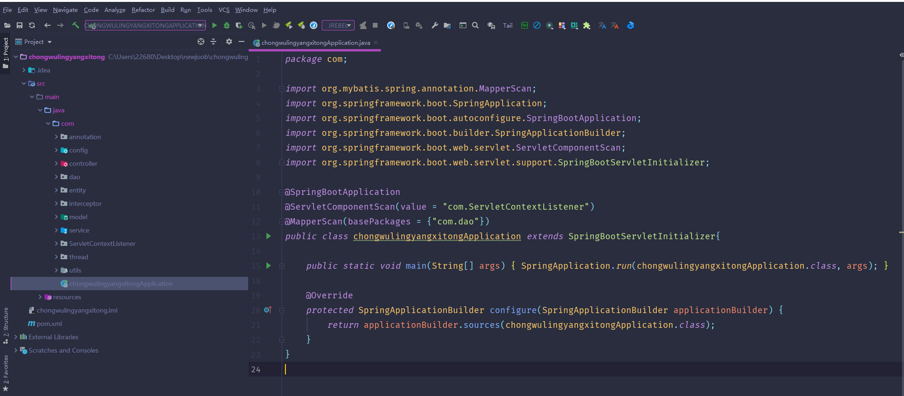
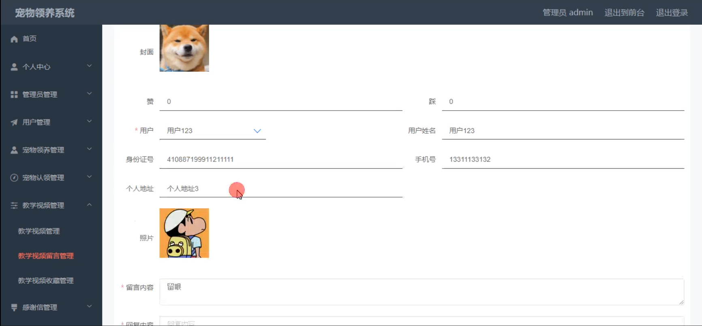

# 基于springboot+vue的宠物领养系统

#### 介绍

随着人们对宠物的喜爱和对动物保护意识的增强，宠物领养成为了一种越来越受欢迎的方式。为了更好地促进宠物的领养和管理，我们开发了基于 Spring Boot + Vue 的宠物领养系统，旨在为宠物提供一个找到温暖家庭的平台，同时也为领养者提供便捷、可靠的服务。

#### 技术栈

后端技术栈：Springboot+Mysql+Maven

前端技术栈：Vue+Html+Css+Javascript+ElementUI

开发工具：Idea+Vscode+Navicate

#### 系统功能介绍

（一）管理员角色  
个人中心：管理员可以在此查看和修改个人信息，接收系统重要通知和消息。  
管理员管理：对其他管理员的账号进行创建、修改、删除，以及设置权限等操作。  
用户管理：审核用户的注册信息，查看用户的详细资料，对违规用户进行处理等。  
宠物领养管理：审核和发布宠物领养信息，包括宠物的基本信息、健康状况、领养要求等。  
宠物认领管理：处理宠物认领的申请和相关流程，确保宠物能够顺利找到新的主人。  
教学视频管理：上传和管理与宠物饲养、训练、护理等相关的教学视频，为领养者提供指导。  
感谢信管理：查看用户提交的感谢信，了解领养者与宠物的幸福生活故事。  
基础数据管理：维护系统中的基础数据，如宠物品种、年龄分类、地区信息等。  
公告管理：发布重要的系统公告，如活动通知、规则变更等，确保用户及时了解相关信息。  
轮播图信息：设置系统首页的轮播图，展示热门宠物、领养活动等重要内容。  

（二）用户角色  
宠物领养：浏览可领养宠物的信息，提交领养申请。  
感谢信：用户可以向平台发送感谢信，分享自己与领养宠物的温馨故事。  
教学视频：观看与宠物相关的教学视频，学习宠物养护知识。  
宠物认领：查看待认领的宠物信息，提交认领申请。  
公告：及时了解系统发布的重要公告和通知。  
个人中心：修改个人资料，查看自己的领养申请、认领申请记录等。  
后台管理  
宠物领养管理：查看自己提交的宠物领养申请状态，修改申请信息。  
宠物认领管理：跟踪自己的宠物认领申请进度，补充必要的资料。  
教学视频管理：收藏喜欢的教学视频，方便后续反复观看。  
感谢信管理：编辑和管理自己提交的感谢信。  
公告管理：查看历史公告，确保不错过重要信息。  

#### 系统作用

宠物领养系统的主要作用包括：  

促进宠物领养： 提供一个集中和便捷的平台，让更多的宠物找到合适的领养家庭。  
提升用户体验： 通过丰富的功能模块，让用户能够轻松浏览宠物信息、提交领养和认领申请、查看感谢信和教学视频等。  
高效管理： 管理员通过后台系统可以高效管理宠物信息、领养和认领申请、感谢信、教学视频和公告，确保系统的顺利运营。  
信息传递： 通过公告和轮播图管理，管理员可以及时向用户传递最新的系统信息和宠物资讯。  

#### 系统功能截图

代码结构

images

数据库表

登录

宠物领养

感谢信

教学视频

个人中心

管理员端用户管理

宠物领养管理

教学视频留言管理

轮播图信息管理

用户端后台管理

#### 总结

宠物领养系统通过分角色管理的方式，实现了用户和管理员不同的需求。用户可以方便地浏览和领养宠物，提交感谢信，观看教学视频，并管理个人信息；管理员则可以高效地管理系统中的各类信息和用户申请，确保系统的正常运行。整个系统的设计和开发基于Spring Boot和Vue框架，具有良好的扩展性和维护性，为后续功能的添加和优化提供了坚实的基础。

#### 使用说明

创建数据库，执行数据库脚本 修改jdbc数据库连接参数 下载安装maven依赖jar 启动idea中的springboot项目

前台登录页面
http://localhost:8080/chongwulingyangxitong/front/index.html

后台登录页面
http://localhost:8080/chongwulingyangxitong/admin/dist/index.html

管理员 			账户:admin 		密码：admin